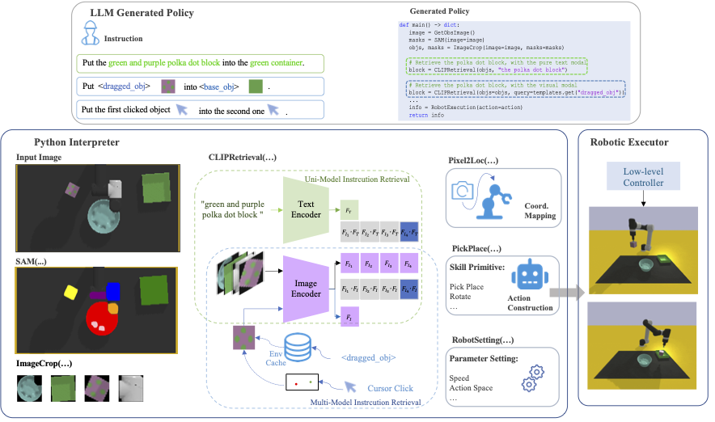
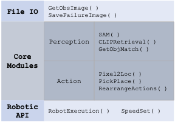
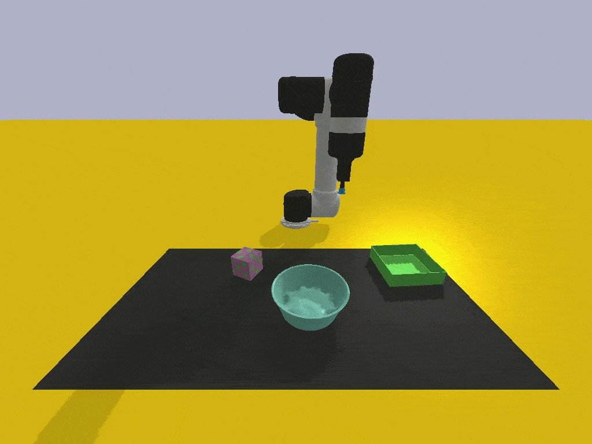
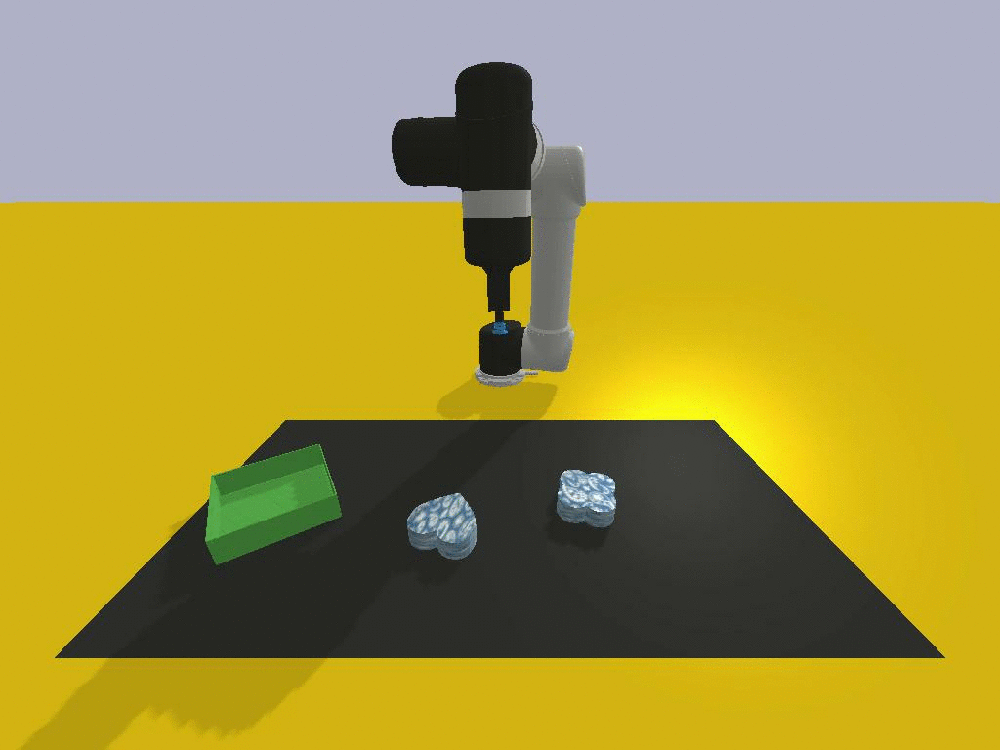
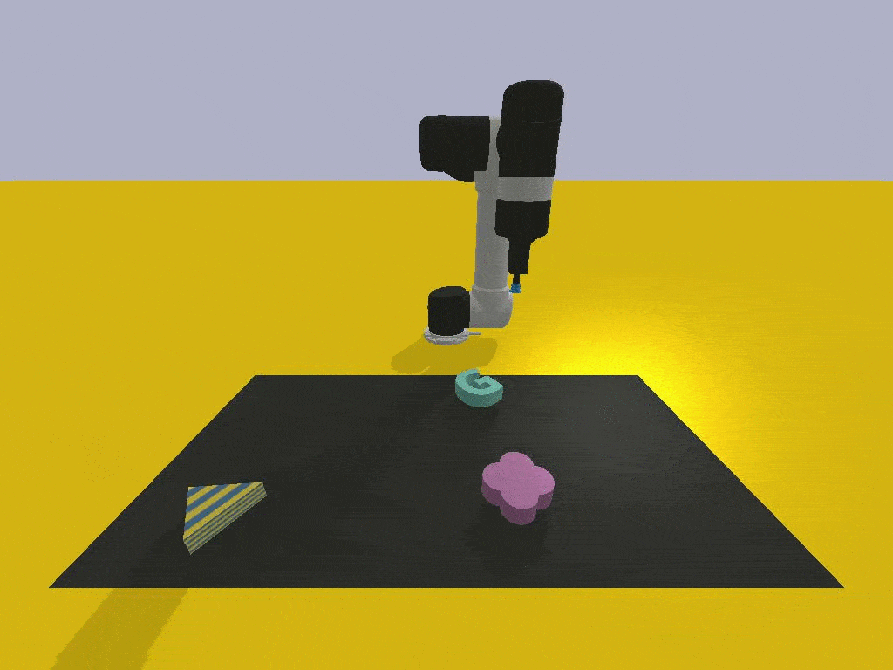

# Instruct2Act: Mapping Multi-modality Instructions to Robotic Actions with Large Language Model

Foundation models have made significant strides in various applications, including text-to-image generation, panoptic segmentation, and natural language processing. This paper presents Instruct2Act, a framework that utilizes Large Language Models to map multi-modal instructions to sequential actions for robotic manipulation tasks. Specifically, Instruct2Act employs the LLM model to generate Python programs that constitute a comprehensive perception, planning, and action loop for robotic tasks. In the perception section, pre-defined APIs are used to access multiple foundation models where the Segment Anything Model (SAM) accurately locates candidate objects, and CLIP classifies them. In this way, the framework leverages the expertise of foundation models and robotic abilities to convert complex high-level instructions into precise policy codes. Our approach is adjustable and flexible in accommodating various instruction modalities and input types and catering to specific task demands. We validated the practicality and efficiency of our approach by assessing it on robotic tasks in different scenarios within tabletop manipulation domains. Furthermore, our zero-shot method outperformed many state-of-the-art learning-based policies in several tasks.  

> [**Instruct2Act: Mapping Multi-modality Instructions to Robotic Actions with
Large Language Model**](https://arxiv.org/pdf/2305.11176.pdf)
> Siyuan Huang, Zhengkai Jiang, Hao Dong, Yu Qiao, Peng Gao, Hongsheng Li

- [Instruct2Act: Mapping Multi-modality Instructions to Robotic Actions with Large Language Model](#instruct2act-mapping-multi-modality-instructions-to-robotic-actions-with-large-language-model)
  - [Supported Modules](#supported-modules)
  - [How to run](#how-to-run)
  - [Prompts Setting](#prompts-setting)
  - [Evaluation Tasks](#evaluation-tasks)
  - [Notes](#notes)
  - [Acknowledgement](#acknowledgement)
 
## Updates:

1. Real-world demo videos can be found on [YouTube](https://www.youtube.com/playlist?list=PLfh183PHOgz_ZYfcUrkZpf1Dri4cN5r2w)
2. We are thrilled that one industrial company (Intewell with Intel) used our I2A to do the flexible manipulation task, more demos are on the way! Stay Tuned. The Video could be found in [Bilibili](https://www.bilibili.com/video/BV12x4y127DK/?vd_source=46bd368e7db8357d25fc181749f07c57).
3. [2024-03-19] We are happy to announce the updated version: [ManipVQA](https://github.com/SiyuanHuang95/ManipVQA). Unlike I2A, ManipVQA focuses more on affordance and physical concept reasoning! Ckpts are released!
4. [2024-06] We further extend the 2D version ManipVQA into 3D Articulated one, named A3VLM. Codes, Ckpts and Dataset can be found at [A3VLM](https://github.com/changhaonan/A3VLM).

## Supported Modules

Currently, we support the following modules:

Correspondingly, please prepare the SAM and CLIP model ckpts in advance. You can download the ckpts from [SAM](https://github.com/facebookresearch/segment-anything#model-checkpoints) and [OpenCLIP](https://github.com/mlfoundations/open_clip). Then set the path in the file 'engine_robotic.py'.

You can also add your personlized modules in 'engine_robotic.py', and add the API definition in the prompt files.

## How to run

1. Install the required packages with the provided *environment.yaml*
    - If you meet any install issue, you can take a look at [Issue](https://github.com/OpenGVLab/Instruct2Act/issues/6). Thanks for @[euminds](https://github.com/euminds).

2. Install the VIMABench with [VIMABench](https://github.com/vimalabs/VimaBench).

3. Change the OpenAI API-key in *visual_programming_prompt/robotic_exec_generation.py*

4. run the *robotic_anything_gpt_online.py*.

## Prompts Setting

In Instruct2Act, we implement two types of prompts, i.e., **task-specific** and **task-agnostic** prompts. The task-specific prompts are designed for specific tasks which is in the VISPROG style, and the task-agnostic prompts are designed for general purpose, and it is in ViperGPT plus VISPROG style. We provide more details in the our paper. And you can change the setting in the file *visual_programming_prompt/robotic_exec_generation.py*. For very specific tasks like robotic manipulations where you know the flow clearly, we suggest to use the task-specific prompts. For general purpose, we suggest to use the task-agnostic prompts. These two prompts are stored in *visual_programm_prompt.py* and *full_prompt.ini* respectively.

Besides the language prompts, we also provide the pointing-language enhanced prompts where cursor click will be used to select the target objects. You can see the details with funcation *SAM()* in *engine_robotic.py*.  

We provide two code generation mode for robotic manipulation tasks, i.e., **offline** and **online** mode. The codes with offline mode are generated in advance and summarized with expert knowledge, and this type is used for the demo and quick-trail usage. The online mode are generated on the fly, and this type is used for the general purpose.

## Evaluation Tasks

We select six representative meta tasks from VIMABench (17 tasks in total) to evaluate the proposed methods in the tabletop manipulation domain, as shown in below. To run the evaluation, please follow the instructions in the [VIMABench](https://github.com/vimalabs/VimaBench).

| Task | Instruction | Visualization |
|:---:|:---:|:---:|
| Visual Manipulation | Put the  polka dot block  into the  green container. |  |
| Scene Understanding | Put the  blue paisley  object in  another given scene image  into the  green object. |  |
| Rotation | Rotate the  letter-M 30  degrees |  |
| Rearrange | Rearrange to the target scene. |  |
| Rearrange then restore | Rearrange objects to target scene and then restore. |  |
| Pick in order then restore | Put the cyan block into the yellow square then into the white-black square. Finally restore it into its original container. |  |

## Notes

1. To speed up the SAM inference progress, we add **cuda** device option in **function build_sam()**, you should modify it accordingly in the source code and then recompile the package.

2. During evaluation, we set the "hide_arm=True" and close the debug_window. If you want to visualize the arm movement, please set them correctly.

3. The orignal movement in VIMABench is quite quick, if you want to slow down the movement, please add some lines like *sleep()* in VIMABench.

4. When use ChatGPT for generation, you need to mange some network stuff. Also, we found that when the network situation is not ideal, sometimes the generated codes are in bad quality (incomplete or too short).

## Acknowledgement

We would like to thank the authors of the following great projects, this project is built upon these great open-sourced projects.

- [VIMABench](https://github.com/vimalabs/VimaBench)
- [OpenCLIP](https://github.com/mlfoundations/open_clip)
- [SAM](https://github.com/facebookresearch/segment-anything#model-checkpoints)

We are also inspired by the following projects:

- [Viper](https://github.com/cvlab-columbia/viper)
- [TaskMatrix](https://github.com/microsoft/TaskMatrix)
- [visprog](https://github.com/allenai/visprog)
